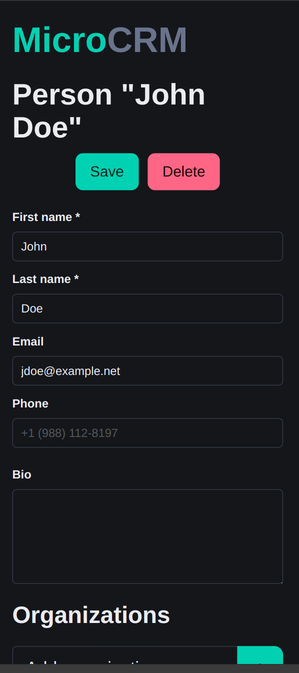

<p align="center">
   
</p>

# MicroCRM — Orion (P7 Full-Stack)

Application CRM simplifiée (Spring Boot 3 + Angular 17) avec chaîne **CI/CD**, conteneurisation **Docker Compose** et analyse **SonarCloud**.




## Sommaire

- [Organisation du code](#organisation-du-code)
- [Démarrage local (sources)](#démarrage-local-sources)
- [Tests](#tests)
- [Docker & Docker Compose](#docker--docker-compose)
- [CI/CD GitHub Actions](#cicd-github-actions)
- [SonarCloud](#sonarcloud)
- [Déploiement (GHCR)](#déploiement-ghcr)
- [Documentation](#documentation)
- [Dépannage](#dépannage)

## Organisation du code

Ce monorepo contient :

| Répertoire | Stack |
|------------|-------|
| `back/` | Java 17, Spring Boot 3, Gradle, HSQLDB |
| `front/` | Angular 17, Karma/Jasmine |
| `misc/docker/` | Caddyfile, configuration Supervisor |
| `.github/workflows/` (racine du dépôt) | Pipelines CI/CD |

## Démarrage local (sources)

### Backend

**Prérequis :** OpenJDK ≥ 17

```shell
cd back
chmod +x gradlew   # si nécessaire
./gradlew build
java -jar build/libs/microcrm-0.0.1-SNAPSHOT.jar
```

API : http://localhost:8080

### Frontend

**Prérequis :** Node.js ≥ 20, npm ≥ 10

```shell
cd front
npm install
npx @angular/cli serve
```

UI : http://localhost:4200

## Tests

### Backend

```shell
cd back
./gradlew test jacocoTestReport
```

Rapport JaCoCo : `back/build/reports/jacoco/test/html/index.html`

### Frontend

```shell
cd front
npm ci
npm run test:ci
```

En local, Chrome/Chromium doit être installé (`CHROME_BIN` si besoin).

## Docker & Docker Compose

### Prérequis

- Docker Engine ≥ 24
- Docker Compose v2

### Stack back + front (recommandé)

```shell
# Depuis ce répertoire (P7-FSJA)
docker compose build
docker compose up -d
```

| Service | URL |
|---------|-----|
| API | http://localhost:8080/persons |
| UI | https://localhost (Caddy, certificat auto) |

```shell
docker compose down
```

### Vérification automatisée

```shell
./scripts/verify-docker.sh
```

### Profil standalone (un seul conteneur)

```shell
docker compose --profile standalone up -d
```

### Images individuelles (sans Compose)

```shell
docker build --target back -t orion-microcrm-back:latest .
docker build --target front -t orion-microcrm-front:latest .
docker run -it --rm -p 8080:8080 orion-microcrm-back:latest
docker run -it --rm -p 80:80 -p 443:443 orion-microcrm-front:latest
```

## CI/CD GitHub Actions

Dépôt : https://github.com/laurentcoufinal/projet9

| Workflow | Fichier | Déclencheur |
|----------|---------|-------------|
| **CI** | `.github/workflows/ci.yml` | Push / PR sur `main` |
| **CD** | `.github/workflows/cd.yml` | CI réussi sur `main`, ou manuel |
| **Nightly** | `.github/workflows/nightly.yml` | Cron 02:00 UTC, ou manuel |

### Étapes CI

1. Build & tests backend (Gradle + JaCoCo)
2. Build & tests frontend (Angular + couverture LCOV)
3. Analyse SonarCloud
4. Build des images Docker Compose

## SonarCloud

### Configuration initiale (une fois)

1. Créer un compte sur [SonarCloud](https://sonarcloud.io).
2. Importer le dépôt GitHub `projet9` et créer le projet (clé suggérée : `laurentcoufinal_projet9`).
3. Générer un token utilisateur.
4. Dans GitHub → **Settings → Secrets and variables → Actions**, ajouter :
   - `SONAR_TOKEN` : token SonarCloud

Le fichier [`sonar-project.properties`](sonar-project.properties) définit les chemins de sources et de couverture.

### Quality Gate (objectifs)

- Aucune nouvelle vulnérabilité Blocker / Critical
- Couverture backend ≥ 50 % (à affiner après le premier scan)
- Hotspots de sécurité revus

## Déploiement (GHCR)

Après un push réussi sur `main`, le workflow **CD** publie :

- `ghcr.io/laurentcoufinal/projet9/orion-microcrm-back:latest`
- `ghcr.io/laurentcoufinal/projet9/orion-microcrm-front:latest`

Sur une machine cible :

```shell
echo $GITHUB_TOKEN | docker login ghcr.io -u USERNAME --password-stdin
docker pull ghcr.io/laurentcoufinal/projet9/orion-microcrm-back:latest
docker pull ghcr.io/laurentcoufinal/projet9/orion-microcrm-front:latest
cd P7-FSJA
docker compose up -d
```

## Documentation

| Document | Description |
|----------|-------------|
| [`documentation-technique.md`](documentation-technique.md) | Documentation complète (pipeline, sécurité, sauvegarde, KPI) — export PDF via Pandoc |
| [`../cdc.md`](../cdc.md) | Cahier des charges |
| [`../documentation techinique.md`](../documentation%20techinique.md) | Template fourni |

## Dépannage

| Problème | Solution |
|----------|----------|
| `gradlew: Permission denied` | `chmod +x back/gradlew` |
| Karma : `No binary for ChromeHeadless` | Installer Chrome ou définir `CHROME_BIN` |
| Front ne joint pas l’API | Vérifier que le back écoute sur `8080` ; l’URL API est dans `front/src/app/config.ts` |
| Healthcheck front en échec | Caddy redirige HTTP→HTTPS ; tester `curl -k https://localhost` |
| SonarCloud échoue en CI | Vérifier `SONAR_TOKEN` et la clé projet dans `sonar-project.properties` |
| Ports déjà utilisés | `docker compose down` ou changer les mappings dans `docker-compose.yml` |

## Licence / contexte

Projet pédagogique OpenClassroom — module P7 DevOps / intégration continue.
