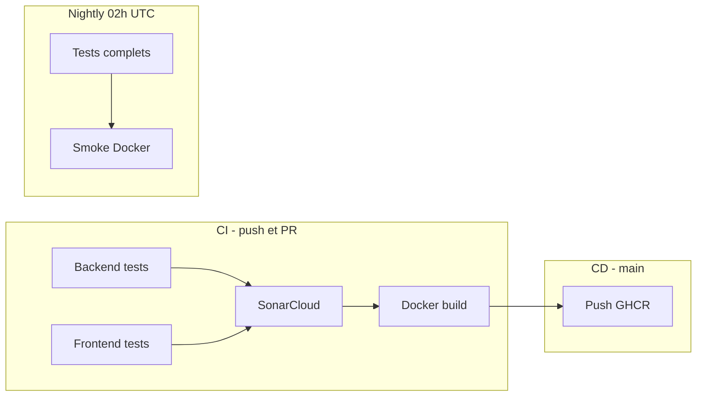

# Documentation technique — Scénario Orion MicroCRM

| | |
|---|---|
| **Titre** | Documentation technique — Industrialisation CI/CD MicroCRM |
| **Auteur** | LT |
| **Date** | 17/05/2026 |
| **Dépôt** | https://github.com/laurentcoufinal/projet9 |
| **Application** | Orion MicroCRM (Spring Boot 3 + Angular 18) |

---

## 1. Introduction

### 1.1 Contexte du projet

Orion est une entreprise spécialisée dans les solutions technologiques. Elle développe **MicroCRM**, une application CRM simplifiée destinée aux équipes technique et commerciale. Jusqu’à présent, les déploiements étaient manuels, ce qui entraînait retards, erreurs humaines et difficulté à maintenir la qualité.

Ce projet vise à **industrialiser la chaîne de livraison** : automatisation des builds, des tests, de l’analyse qualité/sécurité et du déploiement conteneurisé.

### 1.2 Objectifs de l’industrialisation

- Réduire le délai entre un commit et une version déployable testable.
- Garantir la **non-régression** via des tests automatisés à chaque modification.
- Intégrer **SonarCloud** pour la qualité et les vulnérabilités.
- Standardiser le déploiement avec **Docker** et **Docker Compose**.
- Documenter les procédures (sécurité, sauvegarde, mises à jour).

### 1.3 Technologies principales

| Couche | Technologie |
|--------|-------------|
| Backend | Java 17, Spring Boot 3.2, Spring Data REST, Gradle 8.7, HSQLDB |
| Frontend | Angular 18.2, TypeScript, Karma/Jasmine |
| Conteneurisation | Docker multi-stage, Caddy, Alpine Linux |
| CI/CD | GitHub Actions, GHCR |
| Qualité / sécurité | SonarCloud, JaCoCo, Dependabot |

### 1.4 Pipeline CI/CD — vue d’ensemble



**Workflows GitHub :**

- `ci.yml` — build, tests, analyse SonarCloud, construction des images.
- `cd.yml` — publication des images sur GitHub Container Registry après CI réussi sur `main`.
- `nightly.yml` — exécution planifiée quotidienne (tests + Sonar + smoke test Compose).

---

## 2. Étapes de mise en œuvre du pipeline CI/CD

### 2.1 Structure du pipeline

#### Étapes principales

| Étape | Job GitHub Actions | Description |
|-------|-------------------|-------------|
| Build backend | `backend` | `./gradlew build test jacocoTestReport` |
| Build frontend | `frontend` | `npm ci`, `ng build`, `npm run test:ci` |
| Analyse qualité | `sonarcloud` | Scan SonarCloud (Java + TypeScript) |
| Conteneurisation | `docker` | `docker compose build` |
| Déploiement | `cd` (séparé) | Push images vers `ghcr.io` |

#### Ordre d’exécution

1. `backend` et `frontend` en **parallèle**.
2. `sonarcloud` après succès des deux (nécessite binaires Java et rapport LCOV front).
3. `docker` après succès des jobs de build (indépendant de Sonar pour ne pas bloquer en phase de mise en route).
4. `cd` déclenché par la complétion réussie de CI sur `main`, ou manuellement (`workflow_dispatch`).

#### Justification des actions GitHub

| Action | Rôle |
|--------|------|
| `actions/checkout@v4` | Récupération du code source |
| `actions/setup-java@v4` | JDK 17 Temurin + cache Gradle |
| `actions/setup-node@v4` | Node 20 + cache npm |
| `browser-actions/setup-chrome@v1` | Chrome headless pour Karma en CI |
| `SonarSource/sonarcloud-github-action@v2` | Analyse statique centralisée |
| `docker/setup-buildx-action@v3` | Build Docker optimisé |
| `docker/login-action@v3` + `build-push-action@v6` | Publication GHCR |

### 2.2 Scripts d’automatisation

| Script / commande | Rôle |
|-------------------|------|
| `back/gradlew build test jacocoTestReport` | Compile, teste et produit la couverture Java |
| `front/npm run test:ci` | Tests unitaires headless + couverture LCOV |
| `scripts/verify-docker.sh` | Validation locale : build Compose, démarrage, curl API/UI |
| `docker compose up -d` | Orchestration back + front en local |

**Exécution locale du script de vérification :**

```bash
cd P7-FSJA
./scripts/verify-docker.sh
```

### 2.3 Reproductibilité

**Relancer le pipeline :**

- Push ou PR sur `main` → déclenche `ci.yml`.
- Onglet Actions → workflow **Nightly** → *Run workflow*.
- Onglet Actions → workflow **CD** → *Run workflow* (publication manuelle).

**Gestion des secrets (jamais affichés dans les logs) :**

| Secret | Usage |
|--------|-------|
| `SONAR_TOKEN` | Authentification SonarCloud (à créer sur sonarcloud.io) |
| `GITHUB_TOKEN` | Fourni automatiquement ; utilisé pour Sonar et push GHCR |

**Configuration SonarCloud :** fichier [`sonar-project.properties`](sonar-project.properties) — clés `laurentcoufinal_projet9` / organisation `laurentcoufinal` (à aligner avec le projet créé sur SonarCloud).

---

## 3. Plan de conteneurisation et de déploiement

### 3.1 Dockerfiles

Le [`Dockerfile`](Dockerfile) utilise un **build multi-stage** :

| Stage | Image de base | Résultat |
|-------|---------------|----------|
| `front-build` | `node` | Build Angular optimisé |
| `back-build` | `gradle:jdk17` | JAR Spring Boot |
| `front` | `alpine:3.19` + Caddy | Assets statiques, ports 80/443 |
| `back` | `alpine:3.19` + JRE 21 | API sur port **8080** |
| `standalone` | Alpine + Supervisor | Front + back dans un seul conteneur (profil optionnel) |

**Choix techniques :**

- Images Alpine légères pour l’exécution.
- `npm ci` et `./gradlew build` dans des stages dédiés pour maximiser le cache Docker.
- `curl` / `wget` ajoutés pour les healthchecks.
- Correction du port exposé backend : `8080` (et non 4200).

### 3.2 docker-compose.yml

**Services :**

| Service | Image cible | Ports hôte |
|---------|-------------|------------|
| `back` | `target: back` | 8080 |
| `front` | `target: front` | 80, 443 |
| `standalone` | profil `standalone` | 8080, 80, 443 |

**Healthchecks :**

- Backend : `curl -f http://localhost:8080/persons`
- Frontend : `wget` sur `http://localhost:80/`
- Le front démarre uniquement si le back est `healthy` (`depends_on`).

**Lancement local :**

```bash
cd P7-FSJA
docker compose build
docker compose up -d
# API : http://localhost:8080/persons
# UI  : https://localhost (redirection HTTP → HTTPS par Caddy)
docker compose down
```

**Profil tout-en-un :**

```bash
docker compose --profile standalone up -d
```

**Note réseau :** le frontend appelle l’API via `http://localhost:8080` ([`config.ts`](front/src/app/config.ts)). Avec les ports publiés sur l’hôte, le navigateur accède correctement à l’API.

### 3.3 Déploiement (GHCR)

Images publiées par le workflow CD :

- `ghcr.io/laurentcoufinal/projet9/orion-microcrm-back:latest`
- `ghcr.io/laurentcoufinal/projet9/orion-microcrm-front:latest`

Sur une machine cible :

```bash
docker login ghcr.io -u <utilisateur>
docker pull ghcr.io/laurentcoufinal/projet9/orion-microcrm-back:latest
docker pull ghcr.io/laurentcoufinal/projet9/orion-microcrm-front:latest
cd P7-FSJA && docker compose up -d
```

---

## 4. Plan de testing périodique

### 4.1 Types de tests automatisés

| Type | Outil | Périmètre |
|------|-------|-----------|
| Unitaires / intégration backend | JUnit 5, Spring Boot Test | `MicroCRMApplicationTests`, `PersonRepositoryIntegrationTest` |
| Unitaires frontend | Karma, Jasmine, ChromeHeadlessNoSandbox | Composants et services Angular |
| Couverture | JaCoCo (Java), karma-coverage LCOV (TS) | Alimente SonarCloud |
| Qualité / sécurité statique | SonarCloud | Code smells, vulnérabilités, hotspots |
| Smoke infrastructure | `curl` sur stack Docker Compose | Disponibilité API et UI |

### 4.2 Fréquence d’exécution

| Moment | Tests exécutés |
|--------|----------------|
| **Push / PR** sur `main` | Build, tests back/front, SonarCloud, build Docker |
| **Nightly** (cron `0 2 * * *` UTC) | Tests complets, Sonar, smoke Compose |
| **Release** (tag `v*`) | CI complet + images Docker taguées + checklist manuelle |
| **Dependabot** (hebdomadaire) | PR de mise à jour dépendances (Gradle, npm, Actions, Docker) |

### 4.3 Objectifs et critères

| Objectif | Critère de réussite | Alerte |
|----------|---------------------|--------|
| Qualité code | Quality Gate SonarCloud **OK** | Échec job `sonarcloud` |
| Non-régression | 100 % tests unitaires/intégration verts | Échec `backend` ou `frontend` |
| Déploiement sain | Healthchecks Compose + curl API | Échec `docker-smoke` |
| Performance pipeline | Build CI < 15 min (cible) | Notification si dépassement récurrent |

---

## 5. Plan de sécurité

### 5.1 Résultats SonarCloud

Analyse basée sur les rapports de couverture locaux et les corrections appliquées (mai 2026). Dashboard : https://sonarcloud.io/project/overview?id=laurentcoufinal_projet9

| Indicateur | Avant remédiation | Après remédiation (local) | Objectif Quality Gate |
|------------|-------------------|---------------------------|------------------------|
| Couverture backend (lignes) | ~60 % | **~89 %** (JaCoCo, 12 tests) | ≥ 50 % |
| Couverture frontend (lignes) | ~31 % | **~97 %** (29 tests Karma) | ≥ 50 % |
| CORS wildcard `*` | Présent | **Corrigé** — origines explicites via `app.cors.allowed-origins` | Hotspot revu |
| NPE `@PreRemove` | Risque | **Corrigé** — garde `organizations != null` | Bug fermé |
| Dépendance Gradle dupliquée | Oui | **Corrigée** | Code smell fermé |
| Validation entrées REST | Absente | **Ajoutée** — `@NotBlank`, `@Email` sur `Person` / `Organization` | Fiabilité améliorée |
| `CascadeType.ALL` | Présent | **Remplacé** par `PERSIST`, `MERGE` | Risque données réduit |
| Vulnérabilités npm (High) | 28 (Angular 17) | **28** signalées par `npm audit` après **Angular 18.2.14** (dernier patch 18.2.x ; correctifs complets proposés en 19.x uniquement) | Suivi Dependabot |
| Version Angular | 17.3.x | **18.2.14** (LTS) | Patches XSS/XSRF de la branche 18 |

**Corrections code principales :**

- [`SpringDataRestCustomization.java`](back/src/main/java/com/openclassroom/devops/orion/microcrm/SpringDataRestCustomization.java) : CORS configurable.
- [`Person.java`](back/src/main/java/com/openclassroom/devops/orion/microcrm/Person.java) : `removeFromOrganization()`, validation Jakarta.
- Tests : `PersonTest`, `OrganizationTest`, specs Angular avec `HttpTestingController`.
- Types HAL typés dans [`models.ts`](front/src/app/models.ts) ; `API_BASE_URL` via [`environment.ts`](front/src/environments/environment.ts).
- Migration **Angular 18.2.14** : `ng update @angular/core@18 @angular/cli@18` ; providers HTTP (`provideHttpClient`) dans les specs.
- Rapports npm : [`front/audit-avant.txt`](front/audit-avant.txt), [`front/audit-apres.txt`](front/audit-apres.txt).

Le pipeline transmet les rapports aux chemins définis dans [`sonar-project.properties`](sonar-project.properties) :

- `back/build/reports/jacoco/test/jacocoTestReport.xml`
- `front/coverage/lcov.info`

*Captures SonarCloud à insérer en annexe après le prochain scan CI sur `main`.*

### 5.2 Analyse des risques (OWASP Top 10 — contexte MicroCRM)

| Risque OWASP | Évaluation | Mesure en place |
|--------------|------------|-----------------|
| A01 — Contrôle d’accès | **Élevé** (app sans authentification) | Accepté pour démo interne ; à traiter avant exposition Internet |
| A02 — Défaillances cryptographiques | Faible | HTTPS via Caddy en conteneur front |
| A03 — Injection | Faible | Spring Data JPA, pas de SQL natif concaténé |
| A04 — Conception non sécurisée | Moyen | Revue Sonar + Dependabot |
| A05 — Mauvaise configuration | Moyen | Secrets GitHub, pas de credentials dans le repo |
| A06 — Composants vulnérables | **Moyen/Élevé** | npm audit signale des vulnérabilités ; Dependabot hebdomadaire |
| A07 — Identification / auth | N/A (hors périmètre actuel) | — |
| A08 — Intégrité logicielle | Faible | CI sur GitHub, images signées par registre GHCR |
| A09 — Journalisation | Faible | Logs stdout conteneurs ; pas de SIEM |
| A10 — SSRF | Faible | Pas d’appels HTTP sortants dynamiques côté API |

**Risques pipeline :**

- Fuite de `SONAR_TOKEN` → stockage uniquement dans GitHub Secrets.
- Actions compromises → versions épinglées (`@v4`, `@v2`), Dependabot sur `github-actions`.
- Images obsolètes → surveillance `alpine:3.19`, mises à jour planifiées.

### 5.3 Plan d’action / remédiation

| Priorité | Action | Statut |
|----------|--------|--------|
| **Immédiat** | Configurer `SONAR_TOKEN` ; corriger CORS, NPE, smells Gradle | Fait (code) |
| **Immédiat** | Renforcer tests back/front pour couverture Quality Gate | Fait (12 tests Java, specs enrichies) |
| **Court terme** | Migration Angular 18.2.14 + `npm audit fix` | Fait ; audit npm résiduel documenté |
| **Court terme** | Activer Quality Gate bloquante en CI après premier scan vert | À faire sur SonarCloud |
| **Moyen terme** | Spring Security si exposition réseau élargie | Planifié |
| **Long terme** | Trivy, WAF, base persistante chiffrée | Planifié |

---

## 6. Monitoring, métriques et KPI

### 6.1 Métriques DORA

Calculées à partir de l’historique GitHub Actions (onglet *Insights* → *Actions*) :

| Métrique | Définition | Source |
|----------|------------|--------|
| **Lead Time for Changes** | Temps entre commit et déploiement image disponible | `ci.yml` + `cd.yml` timestamps |
| **Deployment Frequency** | Nombre de déploiements réussis / semaine | Runs `CD` sur `main` |
| **MTTR** | Temps moyen de rétablissement après échec CI | Durée entre échec et premier run vert |
| **Change Failure Rate** | % de déploiements entraînant un rollback ou hotfix | Échecs `cd` / total déploiements |

*Valeurs observées : à renseigner après 2–4 semaines d’exploitation.*

### 6.2 KPI personnalisés

| KPI | Cible indicative |
|-----|------------------|
| Durée job `backend` | < 3 min |
| Durée job `frontend` | < 5 min |
| Durée job `sonarcloud` | < 4 min |
| Durée build Docker | < 10 min |
| Taux d’échec CI sur 30 jours | < 10 % |

### 6.3 Synthèse monitoring

- **Points forts :** parallélisation back/front, cache Gradle/npm, healthchecks Compose.
- **Points à améliorer :** métriques DORA automatisées (export API GitHub), alerting (Slack/e-mail sur échec nightly).
- **Dashboards :** SonarCloud (qualité), GitHub Actions (CI), GHCR (versions images).

---

## 7. Plan de sauvegarde des données

### 7.1 Ce qui doit être sauvegardé

| Élément | Criticité | Remarque |
|---------|-----------|----------|
| Code source (Git) | Haute | Source de vérité sur GitHub |
| Workflows / config CI | Haute | `.github/workflows/`, `docker-compose.yml`, `sonar-project.properties` |
| Artefacts build | Moyenne | JAR, images Docker sur GHCR |
| Données CRM | **Basse** (démo) | HSQLDB **en mémoire** — perdues au redémarrage |
| Rapports Sonar | Moyenne | Export PDF / captures depuis SonarCloud |

### 7.2 Procédure de sauvegarde

| Élément | Fréquence | Commande / outil |
|---------|-----------|------------------|
| Dépôt Git | Continu (push) | `git push origin main` |
| Images Docker | À chaque CD réussi | Automatique GHCR ; export local : `docker save -o microcrm-back.tar orion-microcrm-back:latest` |
| Configuration | Hebdomadaire | Tag Git `backup-YYYY-MM-DD` ou branche archive |
| Rapport Sonar | Mensuel | Export depuis l’interface SonarCloud |

### 7.3 Procédure de restauration

**Scénario : déploiement défectueux**

1. Identifier le dernier commit / image stable (`git log`, tag GHCR `sha-xxx`).
2. `git checkout <tag-stable>` ou `docker pull ghcr.io/.../orion-microcrm-back:<sha>`.
3. `docker compose down && docker compose up -d`.
4. Vérifier : `curl http://localhost:8080/persons`.

**Limitations :** aucune restauration de données métier (base volatile). Les fixtures Spring rechargent les données de démo au démarrage.

---

## 8. Plan de mise à jour

### 8.1 Application

| Composant | Outil | Fréquence |
|-----------|-------|-----------|
| Dépendances Maven | Dependabot (`/P7-FSJA/back`) | Hebdomadaire |
| Dépendances npm | Dependabot (`/P7-FSJA/front`) | Hebdomadaire |
| Spring Boot / Angular | PR manuelle après revue changelog | Trimestrielle |
| Images Docker de base | Dependabot docker + revue Dockerfile | Mensuelle |

### 8.2 Pipeline CI/CD

- Mise à jour des actions GitHub via PR Dependabot.
- Revue semestrielle des workflows (permissions, caches, durées).
- Rotation du token SonarCloud annuelle.

### 8.3 Bonnes pratiques

- Toujours passer par une PR pour valider l’impact des mises à jour.
- Ne jamais merger une PR Dependabot sans CI verte.
- Tester localement `verify-docker.sh` avant merge des changements Docker majeurs.

---

## 9. Conclusion

### 9.1 Améliorations apportées

- Pipeline CI/CD complet sur GitHub Actions (build, tests, SonarCloud, Docker).
- Orchestration **Docker Compose** avec healthchecks et script de validation.
- Publication automatisée des images sur **GHCR**.
- Tests **nightly** et alertes Dependabot.
- Documentation opérationnelle et plans sécurité / sauvegarde / testing.

### 9.2 Gains attendus

| Dimension | Gain |
|-----------|------|
| Fiabilité | Tests systématiques avant merge |
| Rapidité | Builds parallèles, cache, images prêtes à déployer |
| Qualité | SonarCloud + couverture de code |
| Sécurité | Analyse statique, gestion des secrets, suivi OWASP |

### 9.3 Recommandations

1. Finaliser la configuration SonarCloud et activer la Quality Gate bloquante.
2. Traiter les vulnérabilités npm signalées par `npm audit`.
3. Ajouter l’authentification avant toute mise en production externe.
4. Automatiser le tableau de bord DORA (script sur API GitHub).

---

## Annexes

### A. Extrait workflow CI (sonarcloud)

```yaml
- name: SonarCloud Scan
  uses: SonarSource/sonarcloud-github-action@v2
  with:
    projectBaseDir: P7-FSJA
  env:
    GITHUB_TOKEN: ${{ secrets.GITHUB_TOKEN }}
    SONAR_TOKEN: ${{ secrets.SONAR_TOKEN }}
```

### B. Commandes utiles

```bash
# Tests backend
cd P7-FSJA/back && ./gradlew test jacocoTestReport

# Tests frontend (CI)
cd P7-FSJA/front && npm run test:ci

# Stack complète
cd P7-FSJA && docker compose up -d

# Vérification automatisée
./P7-FSJA/scripts/verify-docker.sh
```

### C. Captures SonarCloud

*Insérer ici les captures d’écran du tableau de bord SonarCloud après le premier scan réussi.*

### D. Export PDF

```bash
# Exemple avec Pandoc (si installé)
pandoc P7-FSJA/documentation-technique.md -o documentation-technique.pdf --toc
```
