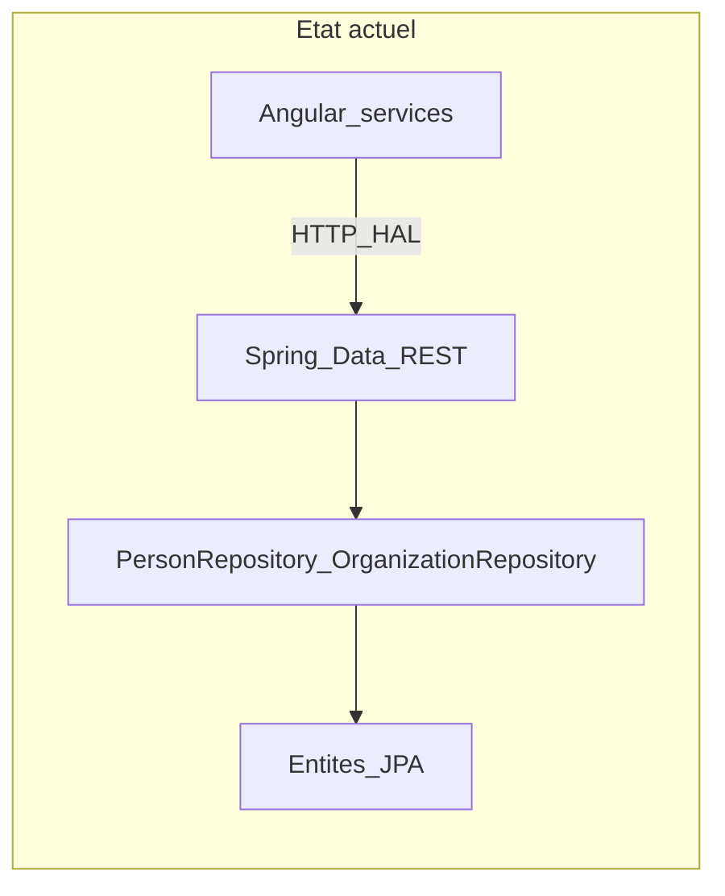
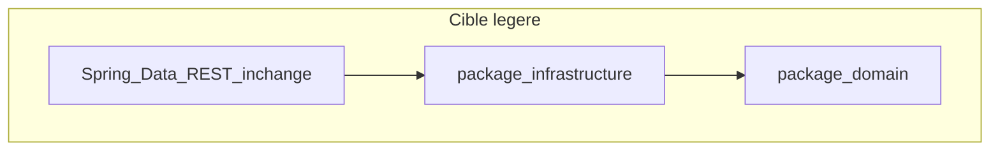

# Modèle métier et évolution DDD — Orion MicroCRM

Document de référence pour le domaine applicatif du projet **MicroCRM** (Orion).  
Objectif principal du dépôt : industrialisation CI/CD (voir `cdc.md` à la racine). Ce document formalise le **contexte métier** et les **propositions d'évolution** pour faciliter les développements futurs.

**Périmètre retenu** : évolution **légère** — restructuration des packages Java et enrichissement du modèle domaine, **sans modifier** le contrat API REST (`/persons`, `/organizations`) ni le pipeline DevOps.

---

## 1. Contexte et architecture actuelle

MicroCRM est un CRM simplifié : contacts (`Person`) et entreprises clientes (`Organization`), avec une relation d'appartenance many-to-many.



| Couche | Technologie | Rôle |
|--------|-------------|------|
| Front | Angular 18 | UI, services HTTP, DTOs HAL |
| API | Spring Data REST | Exposition directe des repositories |
| Persistance | Spring Data JPA + HSQLDB | Entités `Person`, `Organization` |

**Constat** : les entités JPA sont à la fois le modèle de persistance et la surface API publique (pattern proche de l'Active Record). Il n'existe pas de couche application (use cases) ni de séparation domaine / infrastructure.

---

## 2. Bounded context

| Élément | Description |
|---------|-------------|
| **Nom** | `ContactManagement` |
| **Responsabilité** | Gérer les contacts (`Person`) et les organisations (`Organization`), ainsi que l'appartenance d'un contact à une ou plusieurs organisations |
| **Frontières** | Un seul contexte dans l'application actuelle ; pas de contextes multiples (ventes, marketing, etc.) |
| **Hors scope** | Pipeline commercial, authentification, facturation, activités / deals |

### Context map

Un seul contexte — pas de relations inter-contextes (partnership, ACL, etc.) pour l'instant.

---

## 3. Langage ubiquitaire (glossaire)

| Terme code (EN) | Terme métier (FR) | Description |
|-----------------|-------------------|-------------|
| `Person` | Contact | Individu identifié (nom, prénom, email, téléphone, bio) |
| `Organization` | Organisation / compte client | Entreprise ou structure regroupant des contacts |
| `MicroCRM` | Application CRM Orion | Application interne technique + commercial |
| Membership | Appartenance | Lien entre un `Person` et une `Organization` |

**Convention** : le code source utilise l'**anglais** (vocabulaire CRM courant) ; la documentation projet et le cahier des charges sont en **français**.

---

## 4. État actuel — lecture DDD

### 4.1 Entités et comportement

Fichiers principaux : `back/src/main/java/com/openclassroom/devops/orion/microcrm/`

| Classe | Rôle DDD | Comportement existant |
|--------|----------|------------------------|
| `Person` | Entité (anémique + hooks) | Getters/setters, `@PreRemove` pour détacher des organisations |
| `Organization` | Entité (léger modèle riche) | `addPerson`, `removePerson` |
| `PersonRepository` | Infra + API REST | `findByEmail`, `@RepositoryRestResource` |
| `OrganizationRepository` | Infra + API REST | CRUD exposé en HAL |

**Relation JPA** : `ManyToMany` bidirectionnelle (`Organization.persons` / `Person.organizations`).

**Limites actuelles** :

- Pas d'agrégat formalisé ni d'invariants centralisés
- `Person` n'expose pas de méthode symétrique pour rejoindre une organisation
- Les setters publics (`setPersons`, etc.) permettent de contourner les règles métier
- Unicité de l'email : uniquement via `findByEmail` au repository, pas au niveau domaine

### 4.2 Value objects

**Aucun.** Les champs `email`, `phone`, `name` sont des `String` avec Bean Validation (`@Email`, `@NotBlank`) — validation technique, pas encapsulation métier.

### 4.3 Couche application

**Inexistante.** Pas de use cases nommés (`CreatePerson`, `AssignPersonToOrganization`, etc.). L'orchestration est assurée par Spring Data REST et les composants Angular (`person.service.ts`, `organization.service.ts`).

### 4.4 Frontend

`front/src/app/models.ts` : interfaces TypeScript alignées sur le format HAL Spring (`HalEmbeddedPersons`, `HalEmbeddedOrganizations`). Pas de modèle domaine côté client — acceptable pour l'évolution légère.

### 4.5 Tests (atouts)

| Test | Fichier | Couverture |
|------|---------|------------|
| Unitaire | `PersonTest.java` | Constructeur, `@PreRemove` |
| Unitaire | `OrganizationTest.java` | `addPerson` / `removePerson` |
| Intégration | `PersonRepositoryIntegrationTest.java` | Persistance, `findByEmail` |

---

## 5. Diagnostic synthétique

| Pattern DDD | Présent ? | Niveau |
|-------------|-----------|--------|
| Bounded context unique | Implicite | Faible |
| Langage ubiquitaire | Partiel (EN dans le code) | Moyen |
| Modèle riche | Quelques méthodes | Faible |
| Agrégats / invariants | Non | Absent |
| Value objects | Non | Absent |
| Repositories domaine | Non (Spring Data = API) | Absent |
| Application services | Non | Absent |
| Anti-corruption layer | Non (couplage HAL) | N/A (scope léger) |

**Forces** : concepts métier identifiables, tests sur les associations, stack simple.

**Risques** : nouvelles règles métier (unicité email, quotas, historique) risquent d'être dispersées dans Angular ou des hooks JPA sans point d'ancrage domaine.

---

## 6. Décisions de modélisation proposées

### 6.1 Agrégat pragmatique (membership)

Pour l'évolution légère, **`Organization` est le point d'entrée** pour gérer l'appartenance des contacts :

- `Organization.assignMember(Person)` — ajoute le contact et met à jour le côté `Person`
- `Organization.detachMember(Person)` — retire le contact des deux côtés
- `Person.leaveOrganization(Organization)` — variante côté contact si nécessaire

La suppression d'un contact conserve le comportement `@PreRemove` (détachement automatique).

### 6.2 Règles métier à centraliser

| Règle | Implémentation proposée |
|-------|-------------------------|
| Appartenance bidirectionnelle | Méthodes `assignMember` / `detachMember` maintenant les deux collections |
| Doublon dans une organisation | Refuser l'ajout si le contact est déjà membre (`contains`) |
| Suppression d'un contact | `@PreRemove` ou méthode `beforeRemove()` explicite |
| Email | `Person.changeEmail(String)` avec validation ; unicité globale reste au repository en phase 1 |

Exemple de direction (à implémenter dans le code) :

```java
public void assignMember(Person person) {
    Objects.requireNonNull(person);
    if (persons == null) {
        persons = new ArrayList<>();
    }
    if (!persons.contains(person)) {
        persons.add(person);
        person.attachToOrganization(this);
    }
}
```

Les setters exposant des listes mutables (`setPersons`) devront être restreints (`protected`) ou supprimés.

---

## 7. Évolution légère — plan d'action

### 7.1 Cible



**Objectif** : clarifier le domaine dans le code sans changer les endpoints REST ni le pipeline CI/CD.

### 7.2 Restructuration des packages Java

Découper le package plat `com.openclassroom.devops.orion.microcrm` :

```
microcrm/
├── domain/
│   ├── model/          # Person, Organization (logique métier)
│   └── exception/      # ex. DuplicateEmailException (optionnel)
├── infrastructure/
│   ├── persistence/    # entités JPA ou mappers (phase ultérieure)
│   └── rest/           # SpringDataRestCustomization, repositories @RepositoryRestResource
└── MicroCRMApplication.java
```

**Phase 1** : les entités peuvent rester `@Entity` dans `domain.model` (séparation JPA / domaine pur reportée à une phase modérée).

Après déplacement : vérifier `@EntityScan` et `@EnableJpaRepositories` sur `MicroCRMApplication`.

### 7.3 Ordre d'implémentation

1. Créer les packages `domain.model` et `infrastructure` (`persistence`, `rest`).
2. Déplacer `Person`, `Organization`, repositories, `SpringDataRestCustomization`, `InitialDataFixture`.
3. Enrichir le modèle (`assignMember`, `detachMember`, garde-fous) ; mettre à jour `PersonTest` et `OrganizationTest`.
4. Exécuter `./gradlew test` et le smoke Docker (`scripts/verify-docker.sh`).
5. Lier ce document depuis `documentation-technique.md` ou le `README.md` du module.

**Estimation** : 1 à 2 sessions de développement ; risque faible si le schéma JPA et les URLs REST restent identiques.

### 7.4 Hors scope (phase légère)

- Remplacement de Spring Data REST par des `@RestController`
- Value objects `Email`, `PhoneNumber`
- Couche application / CQRS
- Refonte des modèles Angular
- Nouveau module Gradle ou découpage en microservices

---

## 8. Évolutions futures (référence)

| Phase | Changements |
|-------|-------------|
| **Modérée** | Use cases applicatifs, contrôleurs REST ; interfaces de repository dans le domaine, implémentations en infrastructure |
| **Complète** | Value objects, événements domaine, contextes séparés (ex. `Sales` vs `Contacts`), anti-corruption layer pour intégrations externes |

La restructuration légère des packages **prépare** ces phases sans ajouter de dette structurelle.

---

## 9. Critères de succès

- [ ] Packages `domain` et `infrastructure` en place
- [ ] Build Gradle et tests unitaires / intégration verts (Jacoco inchangé)
- [ ] Associations `Person` ↔ `Organization` uniquement via méthodes métier nommées
- [ ] API HAL `/persons` et `/organizations` inchangée pour le front Angular
- [ ] Aucune régression du pipeline GitHub Actions / SonarQube
- [x] Documentation domaine (ce fichier)

---

## 10. Références

| Ressource | Chemin |
|-----------|--------|
| Cahier des charges | `../cdc.md` |
| Doc technique DevOps | `documentation-technique.md` |
| Spécifications de tests (Gherkin) | `definition_test.md` |
| Entité Person | `back/src/main/java/.../microcrm/Person.java` |
| Entité Organization | `back/src/main/java/.../microcrm/Organization.java` |
| Modèles front | `front/src/app/models.ts` |

---

*Dernière mise à jour : analyse DDD initiale — évolution légère validée.*
